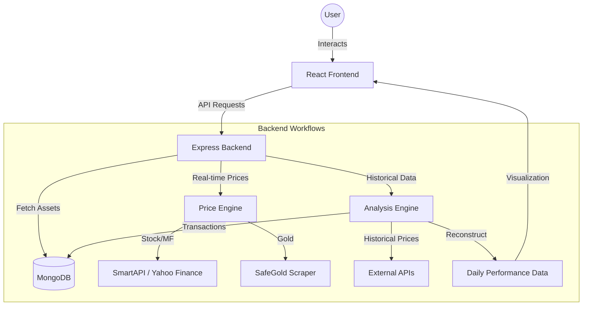

# 🏦 StockConnect - Unified Investment Dashboard

[](https://reactjs.org/)
[](https://vitejs.dev/)
[](https://nodejs.org/)
[](https://www.mongodb.com/)
[](https://tailwindcss.com/)

**StockConnect** is a comprehensive, full-stack investment tracking platform designed to provide a unified view of your diverse portfolio. It consolidates data from **Stocks (Zerodha/Angel One)**, **Mutual Funds**, and **Digital Gold** into a single, intuitive interface.

---

## 🏗️ System Architecture



---

## 🔄 Core Workflows Explained

### 1. Portfolio Reconstruction & Growth Analysis

This is the "brain" of StockConnect. Unlike simple trackers that only show current value, StockConnect can travel back in time:

- **Backtracking**: The system takes your current holdings and "rewinds" them using your transaction history.
- **Historical Price Injection**: It fetches historical closing prices for every single day for every asset in your portfolio (Stocks from SmartAPI/Yahoo, Mutual Funds from AMFI, Gold from historical logs).
- **Daily Snapshot**: It calculates your exact portfolio value, invested capital, and profit for every day in the last year, allowing the interactive charts to show true performance.

### 2. Multi-Source Price Engine

To ensure you always see the latest data, the backend uses a tiered fallback system:

- **Tier 1 (SmartAPI/Kite)**: If connected, it fetches live institutional data.
- **Tier 2 (Yahoo Finance)**: If the primary API is down or the symbol is unique, it falls back to Yahoo Finance (NSE/BSE).
- **Tier 3 (Web Scraping)**: For assets like Gold, it uses `Cheerio` to scrape market-live rates from trusted sources like SafeGold.

### 3. Automated Data Sync

- **Cron Jobs**: The server runs background tasks (via `node-cron`) to fetch and cache prices, reducing API latency for the user.
- **Mutual Fund Mapping**: Uses a custom `amfiMapper` to link ISIN codes from your broker to the global AMFI database for NAV updates.

### 4. Secure Authentication Workflow

- **TOTP Integration**: Handles the mandatory 2FA required by Indian brokers (Zerodha/Angel One) using `otplib`, allowing for seamless automated logins without manual OTP entry.
- **Token Management**: Securely handles OAuth redirects and session management to keep your investment data private.

---

## ✨ Key Features

- **🚀 Real-time Portfolio Tracking**: Live price updates and value calculation for Stocks, MF, and Gold.
- **📈 Advanced Growth Analysis**: Visualize your portfolio's performance over time (1M, 3M, 6M, 1Y, ALL) using interactive charts.
- **🔍 Data Debugger**: Drill down into specific historical dates to see exact asset counts, historical prices, and investment values.
- **💰 Gold Management**: Dedicated section to track and manage physical/digital gold holdings.
- **📊 Intuitive Visualizations**: Clean, responsive charts powered by Recharts for better financial insights.
- **⏱️ Automated Sync**: Backend cron jobs to fetch and update asset prices periodically.

---

## 🛠️ Tech Stack

### Frontend

- **Framework**: React 19 (Vite)
- **Styling**: Tailwind CSS
- **Charts**: Recharts
- **Icons**: Lucide React
- **HTTP Client**: Axios

### Backend

- **Runtime**: Node.js (Express)
- **Database**: MongoDB (Mongoose)
- **APIs**: Zerodha (Kite Connect), SmartAPI (Angel One), Yahoo Finance
- **Utilities**: Node-cron, Cheerio (for web scraping gold prices), otplib (TOTP)

---

## 📁 Project Structure

```text
StockConnect/
├── client/                 # React Frontend
│   ├── src/
│   │   ├── components/     # UI Components
│   │   ├── pages/          # Page views (Dashboard, Growth, Gold, etc.)
│   │   ├── api/            # Backend integration
│   │   └── utils/          # Formatting & logic helpers
├── server/                 # Express Backend
│   ├── src/
│   │   ├── config/         # Database & API configs
│   │   ├── controllers/    # Business logic
│   │   ├── models/         # Mongoose Schemas
│   │   ├── routes/         # API Endpoints
│   │   └── scripts/        # Data sync & import scripts
└── README.md
```

---

## 🚀 Getting Started

### Prerequisites

- Node.js (v20+)
- MongoDB (Atlas or Local)
- API Keys for Zerodha (Kite) or SmartAPI (Angel One)

### 1. Backend Setup

```bash
cd server
npm install
cp .env.example .env
# Edit .env with your MongoDB URI and API credentials
npm run dev
```

### 2. Frontend Setup

```bash
cd client
npm install
npm run dev
```

The application will be available at `http://localhost:5173`.

---

## ⚙️ Environment Variables

Create a `.env` file in the `server` directory with the following:

| Variable               | Description                         |
| ---------------------- | ----------------------------------- |
| `PORT`                 | Backend server port (default: 5001) |
| `MONGO_URI`            | Your MongoDB connection string      |
| `ZERODHA_API_KEY`      | Kite Connect API Key                |
| `SMARTAPI_CLIENT_ID`   | Angel One Client ID                 |
| `SMARTAPI_TOTP_SECRET` | TOTP Secret for Angel One auth      |

---

## 📸 Screenshots

_(Add screenshots here after deploying or running locally)_

- **Dashboard**: High-level overview of total assets.
- **Growth Analysis**: Interactive area charts showing portfolio progression.
- **Gold Management**: Specific tools for tracking gold value.

---

## 🤝 Contributing

1. Fork the project.
2. Create your Feature Branch (`git checkout -b feature/AmazingFeature`).
3. Commit your changes (`git commit -m 'Add some AmazingFeature'`).
4. Push to the Branch (`git push origin feature/AmazingFeature`).
5. Open a Pull Request.

---

## 📄 License

Distributed under the MIT License. See `LICENSE` for more information.

---

Built with ❤️ for better financial clarity.
